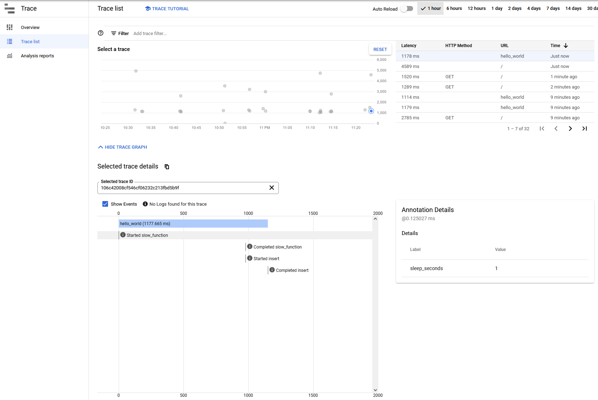

# Python Cloud Run Observability example

Example of using Cloud Trace (OpenTelemetry) and Cloud Logging from Python on Cloud Run.

## Tracing

Capture traces using OpenTelemetry and automatically send them into Cloud Trace in GCP.

Here we instrument functions called to give you a view of when they started and completed within the trace, using events. Optionally you can include kwargs the functions take to be recorded on the start event for context.

## Logging

Coming soon!

## Deploy

Deploy using `gcloud run deploy` and excepting the defaults (you will have to choose a region to deploy to).
